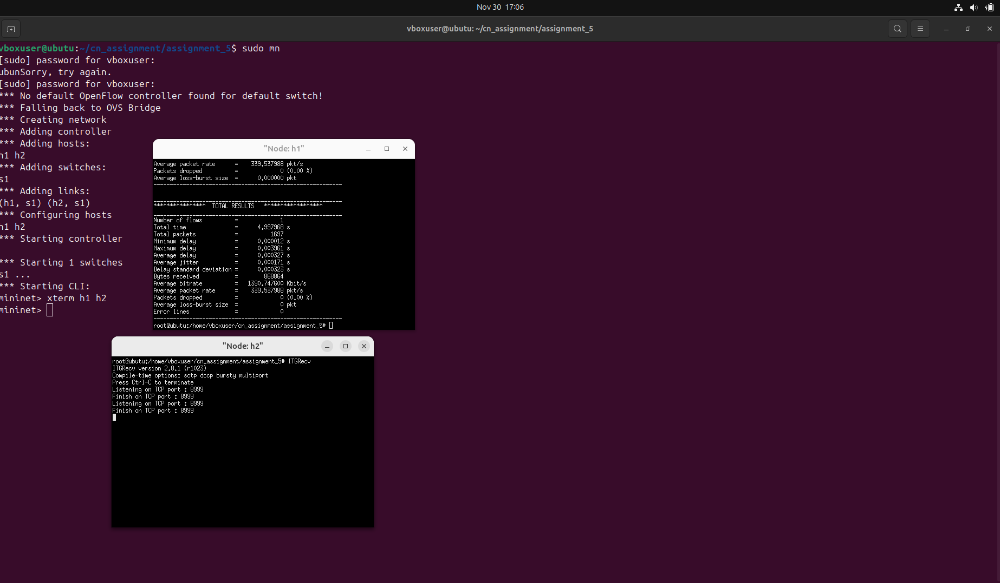

Assignment 5

Objective:
To gain knowledge of more packet capturing tools.

Exercise:
Learn and use maximum number of packet generation tools.
Steps/ Hints: (if any)
1. Install Iperf, D-ITG etc. and send traffic among mininet hosts.
   
Learning Outcomes:
1. Knowledge of packet generation and capturing tools.

