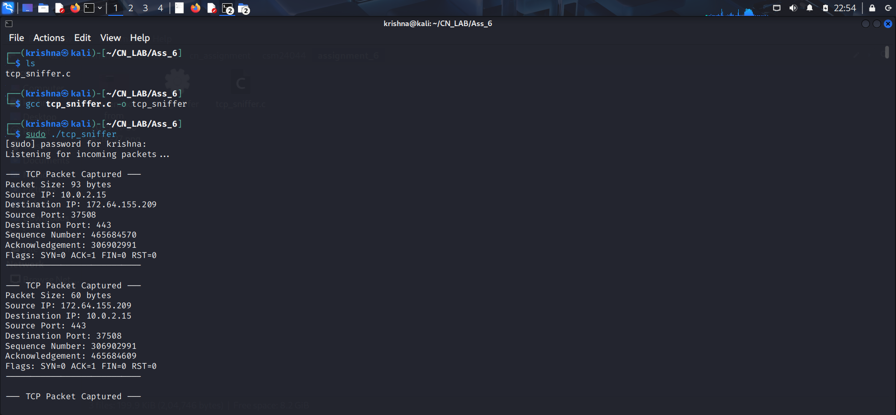

Assignment 6

Objective:
To gain knowledge of more TCP/IP C libraries.

Exercise:
Develop a simple C based network simulator to analyze TCP traffic.
Steps/ Hints: (if any)
1. Use TCP/IP based C libraries including socket to listen to the incoming packets at
the Ethernet port.
2. Extract header and data of the incoming packets.

Learning Outcomes:
1. Knowledge of TCP/IP libraries.

